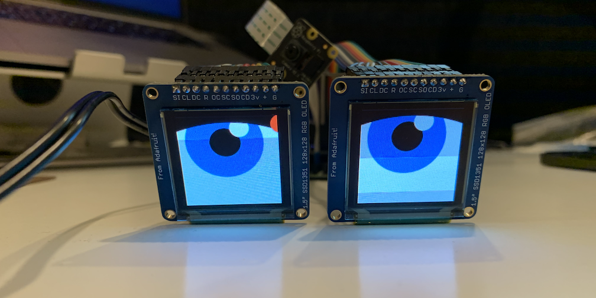

# rpi-eyes
Adafruit animated eyes bonnet used with Processing and cam on the Raspberry Pi to render custom comic eyes 

A little Late for Halloween but maybe just right for german Karneval - it's a Write up about the Googely Eyes 
- Adafruit Eye bonnet
	- https://www.adafruit.com/product/3356
- Follow their direction on how to install all the stuff 
	- https://learn.adafruit.com/animated-snake-eyes-bonnet-for-raspberry-pi/software-installation
- The eyebonnet trick we want to make use of is burried in fbx2.c / the compiled version of it -> it’s scrappping parts of the main screen and is rerouting that to the two displays.
- Because I’m a lazy fuck I didn’t change their scripts yet (also this allows to switch to their pretty cool but more or less random eye movement)
	- // Todo: I think I could utilise some image detection addon board, a cam like pyCam or just add some python tensorflow lite stuff with Picam (I intend to become moar familiar with it at some point. Btw also this Pun was intended 🥳
	- If one thinks about cleaning up -> check pi-eyes.sh to not install all the stuff we’re not using and the fbx2.c file
- Alright, so since we’re lazy and we’re using simple Processing, we’re just renaming the python file that would be called normally. In my case thats the „eyes.py“ in boot/Pi_Eyes (if you need to rename eyes.p depends on the type of screens you attached to the board and the selections you chose in the pi-eyes-installation routine. There’s also cyclops.py for example)
- So whats happening is that raspberry normally would run eyes.py on boot but since we rename it it won’t get called (I know, it’s a really ugly hack 🙂 )
$ cd /boot/Pi_Eyes/  #moving to the Pi_Eyes folder
$ sudo mv eyes.py eyesBAK.py  #renaming the file
$ sudo reboot now  #rebooting to take effect
- Instead we start a processing sketch that renders what ever we want at exactly the locations that fbx2 grabs the graphic information and copies it to the two oleds; check out the Processing sketch to witness my crimes 
- That’s all folks
